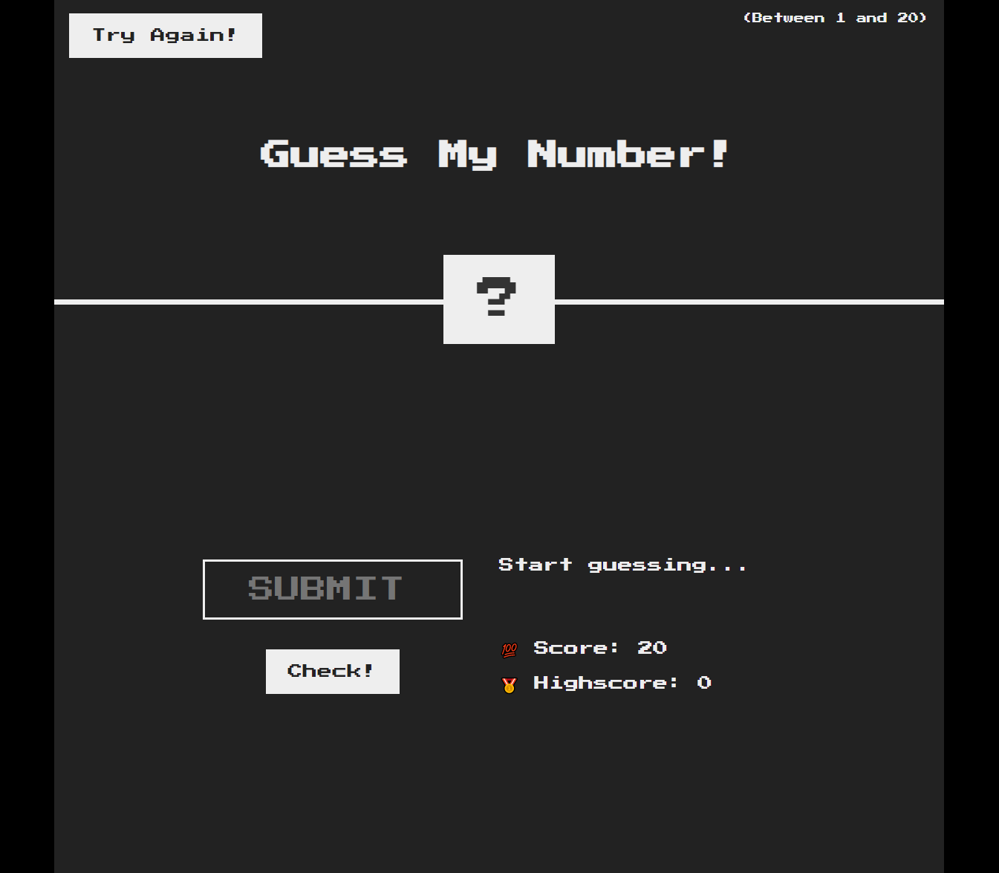

# Guess My Number:

## Description:
The goal of this project is to simply guess a number between 1-20. A message will display whether you guessed the right number or if it is too high or too low. If the number is guessed, the background color will change to green. User starts with a score of 20, as they guess, the score will decrease by 1 point for every wrong guess. If the user loses the background color will change to red. The highest score will remain & the user can play as many times as they’ll like by clicking the “try again” button.

   ### Table of Contents:

   - [Installation](#installation)
   - [Usage](#usage)
   - [Tests](#testing)
   - [Final Product](#final-product)
   - [Questions](#additional-info)

## Installation:
  Vanilla HTML, CSS, & Javascript.
  The project is a Udemy project to help me understand basic JavaScript & continue my learning process after bootcamp.

## Usage:
1. You will be given 20 chances to "guess" the right number
2. submit your number in the "SUBMIT" form & click "Check!"
3. On every wrong prediction your score will decrease by 1.
4. Hints are provided by displaying a message if your number is "Too Low" or "Too High"
5. The screen will change background colors (green if guessed correct/red if you loose by runing out of points)
6. Your highestscore will be displayed & you can try as many times as you want.

## Testing:
- Javascript - Used to base functionality of functions and prompts within the application.
- GitHub - Hosts repository that can be deployed to GitHub Pages 

## Final Product:

[Deployed Link](https://abanae.github.io/Guess-My-Number-Game/)

## Additional Info:
:octocat: [Ana Abad](https://github.com/abanae)
- Email: https://github.com/abanae  